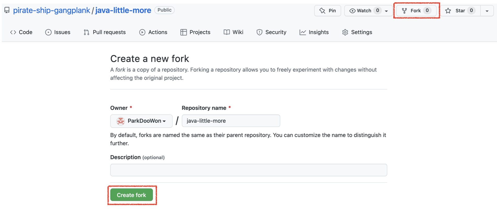
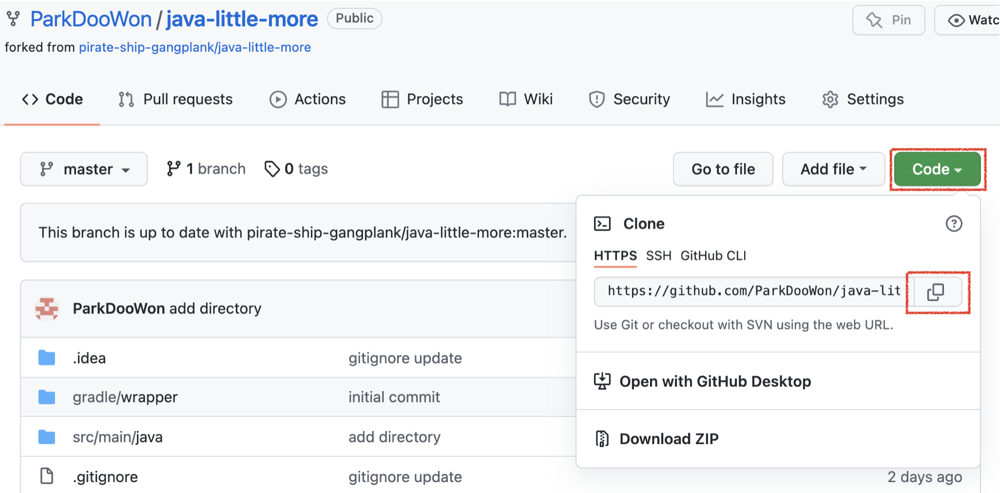
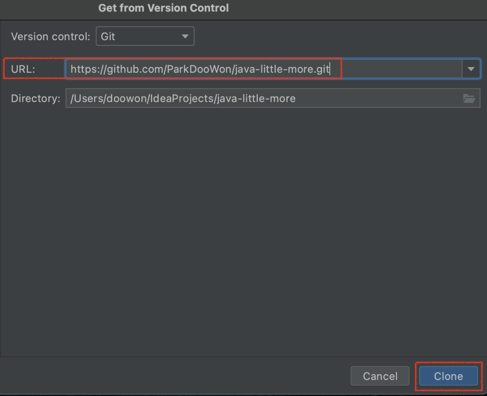
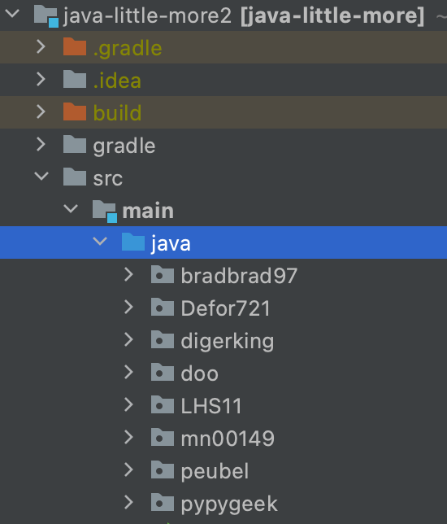
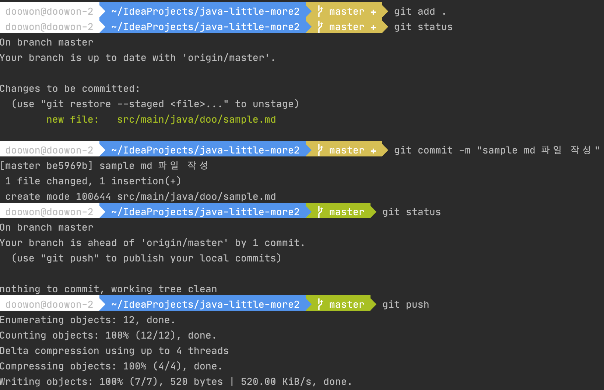
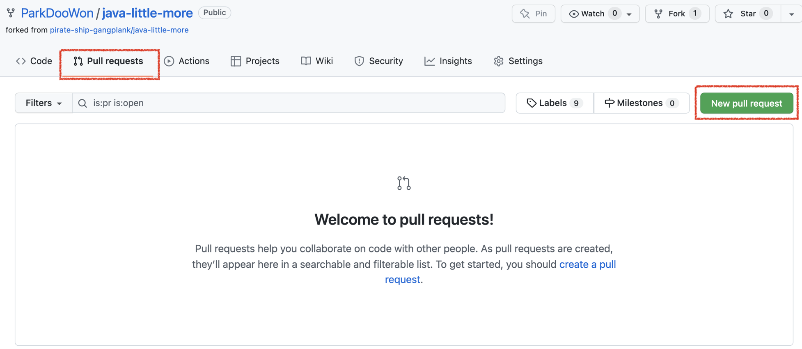
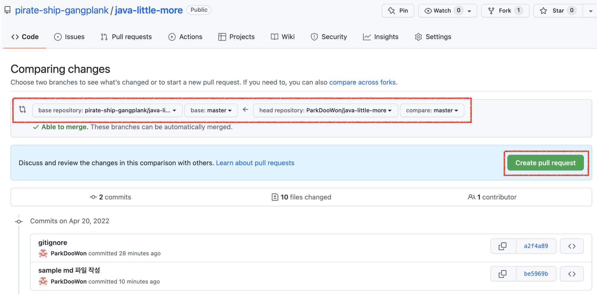
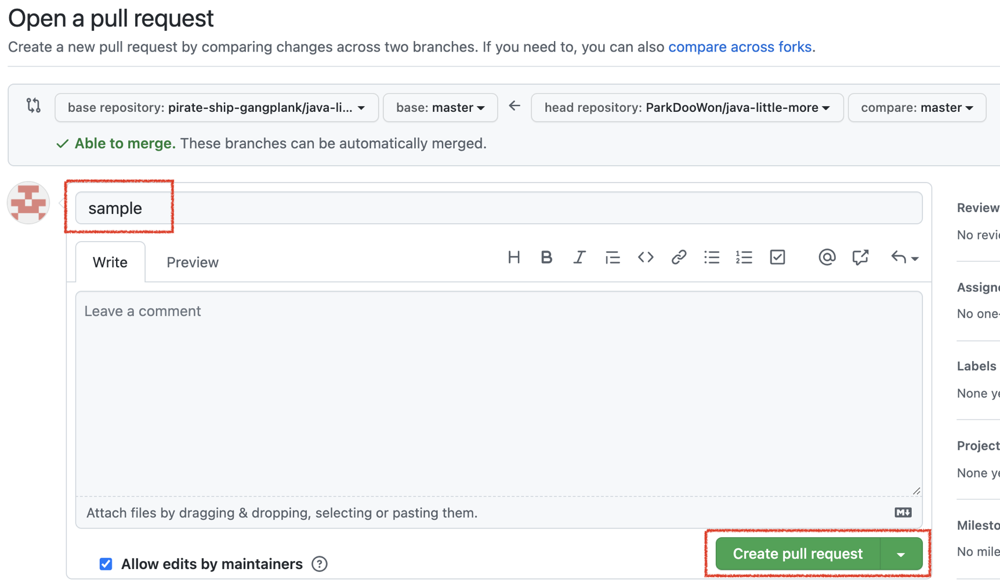
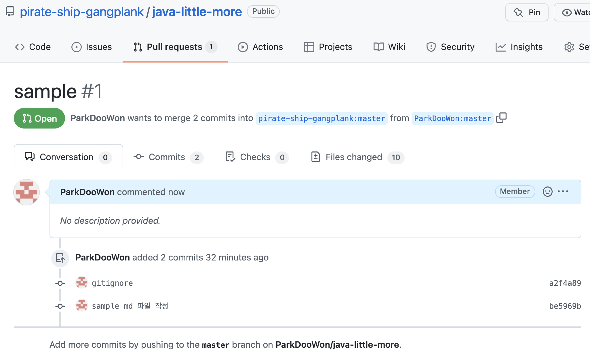

# PR 보내는 법

## 1. fork

초대 받은 [java-little-more](https://github.com/pirate-ship-gangplank/java-little-more) 저장소를 fork 합니다.

링크를 통해 들어간 후에 오른쪽 상단 `Fork` 를 누르고, 바뀐 화면의 왼쪽 하단 `Create fork` 초록색 버튼을 눌러서 fork 해줍니다. 그러면 `본인의 계정명/java-little-more` 저장소가 생겼을 거에요 🙂

</img><br/>

## 2. clone

fork 후에 생성된 각자의 코드 저장소에서 `Code` 초록색 버튼을 누르고, 보이는 url 링크를 복사합니다.
</img><br/>

이제 intelliJ를 켜서 `Get from Version Control` 을 눌러줍니다.

그리고 URL에 아까 복사한 링크를 붙여넣기 하고, `Clone` 버튼을 눌러서 clone 합니다.

</img><br/>

[이클립스인 경우 참고해주세요](https://hgko1207.github.io/2020/05/18/eclipse-git-clone/)

## 3. 코드 저장하기

스터디원분들의 github 계정의 아이디를 디렉토리명으로 만들어뒀습니다.

각자의 github 아이디에 해당하는 디렉토리 안에서 md(마크다운) 파일이나 예제 코드를 작성해주시면 됩니다.
(md 파일의 경우, 노션에 정리한 내용을 그대로 복붙하면 대부분의 내용은 자동으로 옮겨집니다. 하지만, 사진 등의 그렇지않은 부분도 있으니 [md 작성법](https://gist.github.com/ihoneymon/652be052a0727ad59601) 글을 읽고 참고해주세요.)   
</img><br/>

스터디 내용을 모두 정리했다면, 이제 코드를 저장소에 올려보겠습니다.

1. IDE에 있는 터미널창에서 `git add .` 명령을 입력하면 현재 디렉터리 아래의 모든 파일이 저장될 준비가 됩니다.
    - `git add [추가할 파일 경로]` 명령을 입력하면 특정 파일만 추가됩니다.
    - 파일이 제대로 올라갔는지를 보려면 `git status` 명령으로 파일이 제대로 추가됐는지 확인할 수 있습니다.
2. `git commit -m “작성하고자하는 커밋 메세지”` 명령을 입력하면 commit이 됩니다.
3. `git push` 명령으로 각자의 저장소에 커밋한 내용을 올립니다.
    - push할 때 `Support for password authentication was removed on August 13, 2021. Please use a personal access token instead.` 이런 에러가 발생하면서 push가 되지 않는다면, 토큰 생성이 필요하니 [토큰 만드는 방법](https://amkorousagi-money.tistory.com/entry/Git-personal-access-token)을 참고해서 push 해주세요.

</img><br/>

## 4. PR 보내기

1. 내 저장소에서 `Pull requests`를 누르고, `New pull request` 초록색 버튼을 누릅니다.   
</img><br/>
2. **head repository가 본인 저장소**이고, **base repository가 pirate-ship-gangplank**가 맞는지 확인하고, `Create pull request`를 누릅니다.   
</img><br/>
3. PR의 title을 입력해주고, 마지막으로 `Create pull request`를 누르면 PR이 보내집니다.   
</img><br/><br/>

결과
<br/>
</img><br/>
<br/>

-----------------------------------------------------------------------------------------------
유데미 강의를 듣고 특정 자바 부분을 여러명과 함께 스터디를 진행하게 됐다. 그 스터디에 대한 정리를 올릴 예정이다.

# Generics

데이터 종류에 묶이지 않는 ArrayList를 만들려면 어떻게 해야 할까?
=> Generics를 이용하면 된다.

Generics
> - 컴파일시 타입을 체크해 주는 기능
 - 객체의 타입 안정성을 높이고 형변환의 번거로움을 줄여줌
 - 클래스 옆에 타입 변수를 선언해서 사용
```
public class MyCustomList<T>{}  // T-> 변수명 변경 가능 
```
- 메소드 반환형이나 매개변수에서도 사용 (매개변수에 사용할 때는 와일드카드 이용)
```
public class MyCustomList<T> {
    ArrayList<T> list = new ArrayList<>();
    public void addElement(T element){
        list.add(element);
}
```
여러 type 자료형을 받을 수 있다.
```
 MyCustomList<String> list = new MyCustomList<String>();
        list.addElement("Element 1");
        list.addElement("Element 2");
        String value = list.get(0);
        System.out.println(value);
 MyCustomList<Integer> list2 = new MyCustomList<Integer>();
        list2.addElement(1);
        list2.addElement(Integer.valueOf(5));
        Integer number = list2.get(0);
        System.out.println(number); 
```
- Generics에서 자료형을 제한 가능
```
// Number 클래스를 포함한 하위 클래스들만 가능
public class MyCustomList<T extends Number>{}
```
- 제네릭을 이용한 정적 메소드
```
static <X>  X doubleValue(X value){
        return value;
    }
// List 클래스를 포함한 하위 클래스만 가능 ex) Vector, ArrayList
static <X extends List> void duplicate(X list){
        list.addAll(list);
    }    
```
- 와일드 카드 <?> 
  - 제네릭 클래스의 객체를 메소드의 매개변수로 받을 때, 그 객체의 타입 변수를 제한하는 것
  - 제네릭 클래스에서 매개변수로 ArrayList를 받는다고 할 때, ArrayList가 어떤 타입 변수를 가지고 있든 다 받아들일 수 있음
  ex) Integer 만 받아야 되는데 String을 받는다던가..
```
<? extends T> 와일드 카드의 상한 경계 (T와 그 자손들을 구현한 
객체들만 매개변수로 가능)
static double sumOfNumberList(List<? extends Number> numbers){
        double sum = 0.0;
        for (Number number : numbers) {
            sum += number.doubleValue();
        }
        return sum;
    }
```
```
<? super T> 와일드 카드의 하한 경계 (T와 그 상위 클래스를 구현한 
객체들만 매개변수로 가능)	
static void addACoupleOfValues(List<? super Number> numbers){
        numbers.add(1);
        numbers.add(1L);
        numbers.add(1.0f);
        numbers.add(1.0);
    }
```


--------------------------------------------------------------------------
# 자바 함수형 프로그래밍

매개변수로서 함수
>
```
private static void printBasic(List<String> list) {
        for (String string : list) {
            System.out.println(string);
        }
    }
```
```
private static void printWithFP(List<String> list) {
        list.stream().forEach( 
                element -> System.out.println(element) // 람다식
        );
    }
```
위 두 메소드는 같은 결과를 도출한다.
- stream은 값의 흐름(list 안의 원소들)
- foreach는 stream에서 데이터가 아닌 흐름의 각 요소마다 실행될 함수를 보내는 것
- () -> => 람다식 (불필요한 코드를 줄이고, 가독성을 높임)
- element에 list안의 원소들이 들어가고 System.out.println(element)에서 시행

함수형 프로그래밍 - 필터 (filter)
>
```
private static void printBasicWithFiltering(List<String> list) {
        for (String string : list) {
            if(string.endsWith("at"))
                System.out.println(string);
        }
    }
```
```
private static void printWithFPWithFiltering(List<String> list) {
        list.stream()
                .filter( 
                        element -> element.endsWith("at")
                )
                .forEach( 
                        element -> System.out.println(element) 
                );
    }
```
위 두 메소드는 문자열의 끝이 at으로 끝나는 문자열을 구하는 메소드
- filter 안에 조건문이 true 일 때만 forEach 수행
  (filter 안의 조건문이 만족시키는 것들만 골라내는 것)
- 함수형 프로그래밍을 함으로써 많은 양의 logic을 반복문 없이 구현 가능

함수형 프로그래밍 - 모음 (reduce)
>
```
private static Integer normalSum(List<Integer> numbers){
        int sum=0;
        for (Integer number : numbers) {
            sum+=number;
        }
        return sum;
    }
```
```
private static Integer fpSum(List<Integer> numbers) {
        return numbers.stream() 
                .reduce(
                        0, 
                        (num1, num2) -> num1 + num2 
                );
    }
ex) 4, 6, 8, 13
  num1=0, num2=4 -> num1=4
  num1=4, num2=6 -> num1=10
  num1=10, num2=8 -> num1=18
  num1=18, num2=13 -> num1=31
```
위 두 메소드는 리스트들의 합을 구하는 메소드
- reduce(n1,람다식) => 첫 번째 매개변수는 시작값, 두 번째 매개변수는 함수 정의
- 두 개의 매개변수가 있을 때는 괄호가 꼭 필요
- 중간에 filter를 이용해서 홀수들의 합도 구할 수 있음
- 함수형 프로그래밍을 이용하면 지역변수나 반복문을 사용할 필요X
  (변수 변이를 피함)
```
numbers.stream()
                .reduce(
                        0,
                        (num1, num2) -> {
                            System.out.println(num1 + " " + num2);
                            return num1 + num2;
                        } // <- 람다 표현식 (단축 메소드) 
  						 );
```

중간 연산과 종산 연산
> - 중간 연산은 요소를 받고, 요소 스트림을 받아 스트림 안의 숫자를 reduce하거나 다른 종류의 요소로 map 가능
- 중간 연산의 결과는 또 다른 스트림이고 종단 연산에서는 요소를 처리하고 소모
- 중간 연산의 예
  - fillter, map, sort, distinct 등

  중간 연산(Sort, Distinct, Filter, Map)
>
```
numbers=[3,5,7,8,3,7,11]
numbers.stream().distinct().sorted().map(e->e*e)
	.forEach(e->System.out.println(e));
=> 9 25 49 64 121
```
- distinct() : 중복값 제거
- sorted() : 정렬
- map() : 새로운 값으로 mapping

최대값 연산
> - 스트림 안의 max 메소드가 적용되지 않기 때문에 비교자 인터페이스를 구현해야함
```
	Integer max = List.of(23, 45, 67, 34).stream()
                .max((n1, n2) -> Integer.compare(n1, n2))
                .get();
```

collect
>
```
List.of(23,12,34,53).stream().filter(e->e%2==1)
	.collect(Collectors.toList())
 ```
 ```
IntStream.range(1,11).map(e->e*e)
	.boxed()
	.collect(Collectors.toList())
```

자바의 Optional 클래스
> 
```
List.of(23,45,57).stream.filter(n -> n%2==0)
	.max( (n1,n2) -> Integer.compare(n1,n2))
=> Optional[12]
```
- Optional은 null값을 반환하지 않기 위해 사용

함수형 인터페이스
> 
```
 List.of(23, 43, 34, 45,36,48).stream()
                .filter(n->n%2==0)
                .map(n->n*n)
                .forEach(e-> System.out.println(e));
```
#### 여기서 filter가 어떻게 적용이 되는가? => 함수형 인터페이스(Prediacate 인터페이스) 덕분에 가능
- Stream<T> filter(Predicate<? super T> predicate);
- boolean test(T t)
```
class EvenNumberPredicate implements Predicate<Integer>{
    @Override
    public boolean test(Integer number) {
        return number%2==0;
    }
}
```
위의 메소드 number에 stream 요소들이 들어가게 된다.
- 필터링 후에 메소드에 값을 집어넣음
- Predicate => 입력값을 보고 참인지 거짓인지 판단하여 그 값을 반환
#### forEach는 어떻게 적용이 되는가?
- Consumer<? super T> action
- void accept(T t)
- Consumer는 허용 메소드
```
class SystemOutConsumer implements Consumer<Integer>{
    @Override
    public void accept(Integer number) {
        System.out.println(number);
    }
}
```
- forEach() 안의 정의가 Consumer 인터페이스 안의 accept 메소드가 정의가 된다
- Consumer => 사용자가 어떤 값을 입력해 주고 그에 대한 소비를 진행(어떤 값도 반환 X)
#### Map은 어떻게 적용이 되는가?
- <R> Stream<R> map(Function<? super T, ? extends R> mapper;
- R apply (T t)
```
class NumberSquareMapper implements Function<Integer,Integer>{
    @Override
    public Integer apply(Integer number) {
        return number * number;
    }
}
```
- Function=> 함수형 인터페이스로 입력값을 얻고 어떤 값을 출력해내는 인터페이스를 뜻함
- 입력하면 출력값을 도출

메소드 레퍼런스를 통한 함수형 프로그래밍 코드 축약
>
```
 List.of("Ant", "Bat","Cat","Dog","Elephant").stream()
                .map(String::length)
                .forEach(MethodReferencesRunner::print);
                // .forEach(System.out::println) 와 결과 동일
                // class::method
 MethodReferencesRunner 클래스 안에 print 메소드를 생성
```
```
 public static void print(Integer number){
        System.out.println(number);
    }
```
- class :: method 형식으로 축약 가능 
메소드 참조 사용하는 이유=> 코드의 가독성을 높이기 위함
---------------------------------------------------------------------
# 자바의 스레드와 동시성

Thread의 필요성 => 쓰레드를 사용하지 않으면 수행문을 차례대로 기다려함

Thread 낭비를 줄이기 위해 MultiThread가 필요! 
- Threads : 유사성을 가진 모든 수행문을 동시에 실행하도록 해줌, 병렬적으로 처리가능 (놀거나 비는 시간 없이 지속해서 코드를 진행)

### 1. Thread를 생성하는 2가지 방법
> 
```
class Task1 extends Thread{
    public void run(){ //SIGNATURE
        System.out.print("\n Task1 Started");
        for(int i=101;i<=199;i++){
            System.out.print(i+" ");
        }
        System.out.print("\n Task1 Done");
    }
}
```
```
class Task2 implements Runnable{
    @Override
    public void run() {
        System.out.print("\n Task2 Started");
        for(int i=201;i<=299;i++){
            System.out.print(i+" ");
        }
        System.out.print("\n Task2 Done");
    }
}
```
- Thread class 상속
- Runnable interface 구현

### 2. Thread가 가질 수 있는 다양한 상태
> 
- New : start 메소드 실행 전 상태의 Thread
- Runnable : 실행하려고 하지만 이미 다른 Thread가 실행되고 있는 상태
- Running : 특정 지점의 상태를 실행
- Blocked/Waiting : 데이터베이스를 이용하고 있는데, 데이터베이스가 느려 차단당함 / 입력을 위해 대기하고 있거나 실행완료 되지 않은 쓰레드로부터 데이터 입력을 받아야함
- Terminated/dead : 실행이 모두 끝난 상태

### 3. Thread에 대해 각각 다른 우선순위를 부여
>
- Thread 클래스의 setPriority 메소드
- 구체적인 task에 대해서 우선순위를 정함
- 무조건적 X (추천)
- MAX_PRIORITY : 10, MIN_PRIORITY = 1 (높을 수록 우선)
```
//Task1
        System.out.print("\n Task1 Kicked Off");
        Task1 task1 = new Task1();
        task1.setPriority(1);
        task1.start(); // thread로 사용하고 싶으면 start() 메소드 이용
        System.out.print("\n Task2 Kicked Off");
//Task2
        Task2 task2 = new Task2();
        Thread thread = new Thread(task2);
        thread.setPriority(10);
        thread.start();
```

### 4. Thread사이의 소통
> 
- Thread 클래스의 join 메소드 : 해당 Thread가 다 끝난 후에야 다음 코드로 넘어감
```
try {
            task1.join();
            thread.join(); // task2
        } catch (InterruptedException e) {
            throw new RuntimeException(e);
        }
        System.out.print("\n Task3 Kicked Off");4
//Task3
        for(int i=301;i<=399;i++){
            System.out.print(i+" ");
        }
        System.out.print("\n Task3 Done");
        System.out.print("\n Main Done");
```
=> task1,task2를 모두 실행한 후에 task3가 실행됨

### 5. ExecutorService에서 몇 개의 쓰레드를 동시 사용하여 task를 진행
```
ExecutorService executorService = Executors.newSingleThreadExecutor()
```
> - 한번에 하나의 Thread 실행

```
ExecutorService executorService = Executors.newFixedThreadPool(n);
```
>- 사용되는 Thread의 개수가 n개

### 6. 쓰레드에서 결과가 얻어지는 지점 설정 가능
```
class CallableTask implements Callable<String>{

    private String name;

    public CallableTask(String name) {
        this.name = name;
    }

    @Override
    public String call() throws Exception {
        Thread.sleep(1000);
        return " Hello " + name;
    }
}
public class CallableRunner {

    public static void main(String[] args) throws ExecutionException, InterruptedException {

        ExecutorService executorService = Executors.newFixedThreadPool(1);

        Future<String> welcomeFuture = executorService.submit(new CallableTask("in28minutes"));

        System.out.println("\n new CallableTask(\"in28Minutes\") executed");

        String welcomeMessage = welcomeFuture.get(); // 이 코드가 실행될 때까지 기다렸다가 실행하고 다음 줄의 코드가 실행됨

        System.out.print(welcomeMessage);

        System.out.print("\n Main completed");

    }
}
```
>- Callable을 통해 결과가 얻어지는 시점을 결정할 수 있다
-  Future : 결과가 나올 것을 예측
- get(): 실행이 완료될 때까지 기다림, 그 다음 줄의 코드가 실행

### 7. invokeAll, invokeAny
> - invokeAll : 다량의 task 한번에 처리

```
		ExecutorService executorService = Executors.newFixedThreadPool(1);
        
 		List<CallableTask> tasks
                = List.of(new CallableTask("in28Minutes"),
                new CallableTask("Ranga"), new CallableTask("Adam"));


        List<Future<String>> results = executorService.invokeAll(tasks);

        for (Future<String> result : results) {
            System.out.println(result.get());
            
        }
```
> - invokeAny : 하나의 task의 실행이 완료된 것을 기다린 후 결과를 얻는 메소드

```
		ExecutorService executorService = Executors.newFixedThreadPool(2);
        
        List<CallableTask> tasks
                = List.of(new CallableTask("in28Minutes"), 
                new CallableTask("Ranga"), new CallableTask("Adam"));

        String result = executorService.invokeAny(tasks);

        
        System.out.println(result);
```
> - 세가지 종류의 서비스를 사용하고 있는데, 소비자에게 가장 빠른 결과를 제공하고 싶다면, 가장 먼저 나오는 결과를 반환
